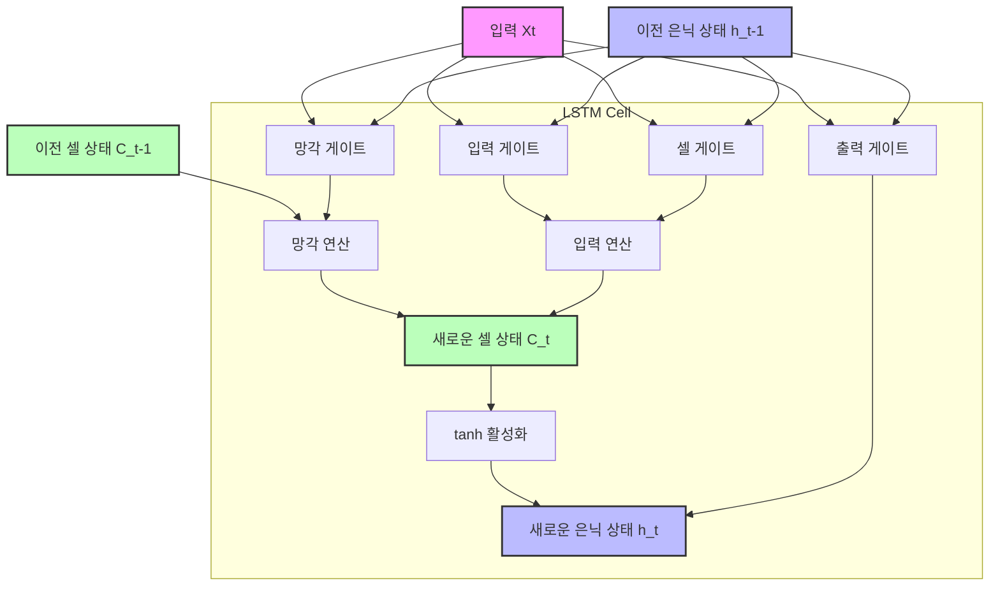

```mermaid
graph TD
    Input[입력 Xt] --> FG[망각 게이트]
    Input --> IG[입력 게이트]
    Input --> CG[셀 게이트]
    Input --> OG[출력 게이트]
    
    PrevH[이전 은닉 상태 h_t-1] --> FG
    PrevH --> IG
    PrevH --> CG
    PrevH --> OG
    
    PrevC[이전 셀 상태 C_t-1] --> FC[망각 연산]
    
    FG --> FC
    
    IG --> IC[입력 연산]
    CG --> IC
    
    FC --> CC[새로운 셀 상태 C_t]
    IC --> CC
    
    CC --> TC[tanh 활성화]
    TC --> HC[새로운 은닉 상태 h_t]
    OG --> HC
    
    style Input fill:#f9f,stroke:#333,stroke-width:2px
    style PrevH fill:#bbf,stroke:#333,stroke-width:2px
    style PrevC fill:#bfb,stroke:#333,stroke-width:2px
    style CC fill:#bfb,stroke:#333,stroke-width:2px
    style HC fill:#bbf,stroke:#333,stroke-width:2px
    
    subgraph LSTM Cell
    FG
    IG
    CG
    OG
    FC
    IC
    CC
    TC
    HC
    end
```
