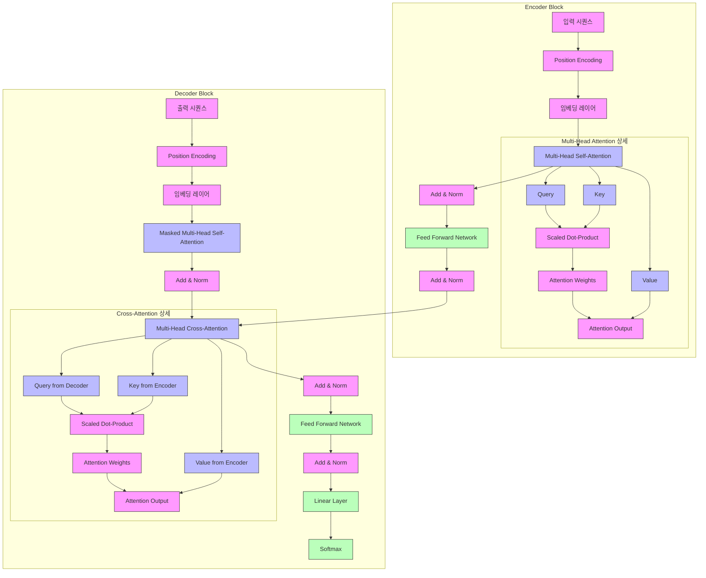

```mermaid
graph TB
    subgraph "Encoder Block"
        Input[입력 시퀀스] --> PE1[Position Encoding]
        PE1 --> EMB1[임베딩 레이어]
        EMB1 --> MHA1[Multi-Head Self-Attention]
        MHA1 --> ADD1[Add & Norm]
        ADD1 --> FFN1[Feed Forward Network]
        FFN1 --> ADD2[Add & Norm]
        
        subgraph "Multi-Head Attention 상세"
            MHA1 --> Q1[Query]
            MHA1 --> K1[Key]
            MHA1 --> V1[Value]
            Q1 & K1 --> SM1[Scaled Dot-Product]
            SM1 --> ATT1[Attention Weights]
            ATT1 & V1 --> OUT1[Attention Output]
        end
    end

    subgraph "Decoder Block"
        Output[출력 시퀀스] --> PE2[Position Encoding]
        PE2 --> EMB2[임베딩 레이어]
        EMB2 --> MHSA[Masked Multi-Head Self-Attention]
        MHSA --> ADD3[Add & Norm]
        ADD3 --> MHA2[Multi-Head Cross-Attention]
        ADD2 --> MHA2
        MHA2 --> ADD4[Add & Norm]
        ADD4 --> FFN2[Feed Forward Network]
        FFN2 --> ADD5[Add & Norm]
        ADD5 --> LN[Linear Layer]
        LN --> SF[Softmax]
        
        subgraph "Cross-Attention 상세"
            MHA2 --> Q2[Query from Decoder]
            MHA2 --> K2[Key from Encoder]
            MHA2 --> V2[Value from Encoder]
            Q2 & K2 --> SM2[Scaled Dot-Product]
            SM2 --> ATT2[Attention Weights]
            ATT2 & V2 --> OUT2[Attention Output]
        end
    end
    
    classDef default fill:#f9f,stroke:#333,stroke-width:1px
    classDef attention fill:#bbf,stroke:#333,stroke-width:1px
    classDef process fill:#bfb,stroke:#333,stroke-width:1px
    
    class MHA1,MHA2,MHSA attention
    class FFN1,FFN2,LN,SF process
    class Q1,K1,V1,Q2,K2,V2 attention
```
